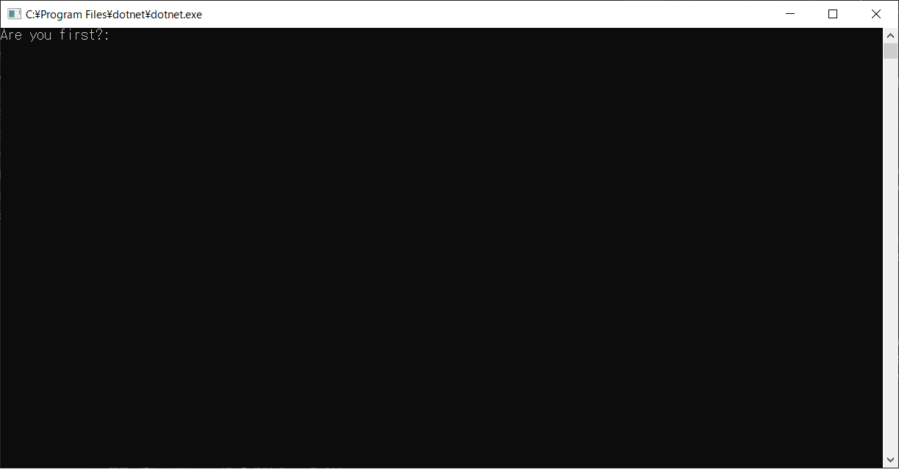
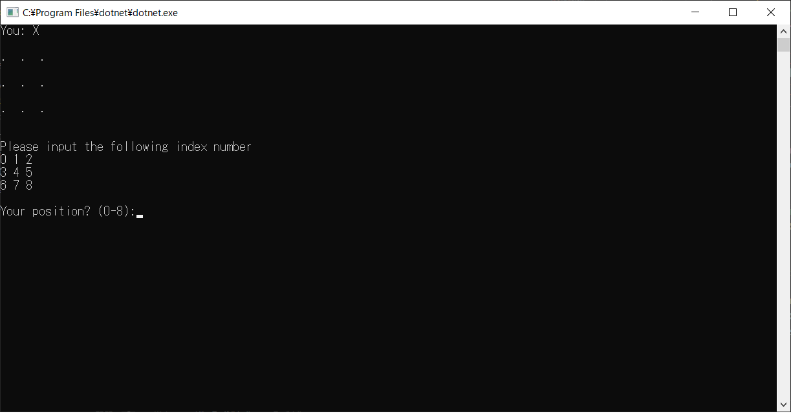
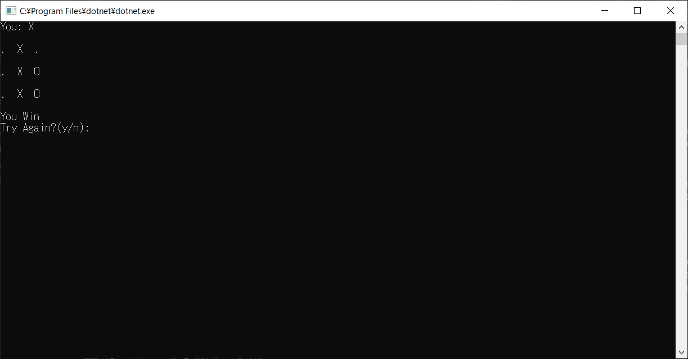

<!-- ABOUT THE PROJECT -->

# Welcome to the My Tic Tac Toe game.

Note: Sorry, it only supports Windows.

The functions are as follows :

- This game is a command line game
- You can play against the computer
- You can play as many times as you like
- You can choose first or second
- You can quit at any time

Please enjoy the game!!

(<a href="#top">back to top</a>)

### Development environment

- C# for Microsoft .net 6.0
- Visual Studio Code 1.68.0
- Windows 10 Professional

(<a href="#top">back to top</a>)

     

## Release

Only exe can be downloaded from the following link.

- [TicTacToe.exe](https://github.com/myamamoto-repo/TicTacToe/releases/tag/v1.0.0)

## Usage

1. Please run TicTacToe.exe
2. Please select first or second(input y or n)

  

3. Enter the location from 0 to 8 according to the displayed information

  

4. The computer will automatically determine the location

5. Result will show automatically.Enter 'y' to continue playing. 

  

(<a href="#top">back to top</a>)

